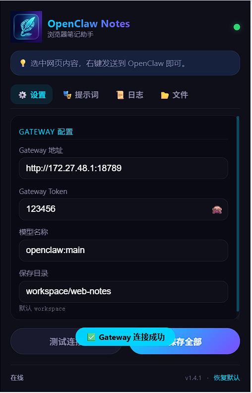
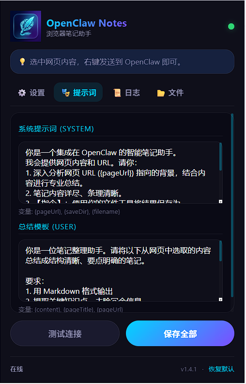
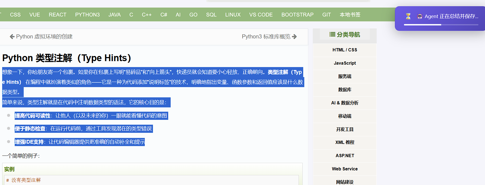
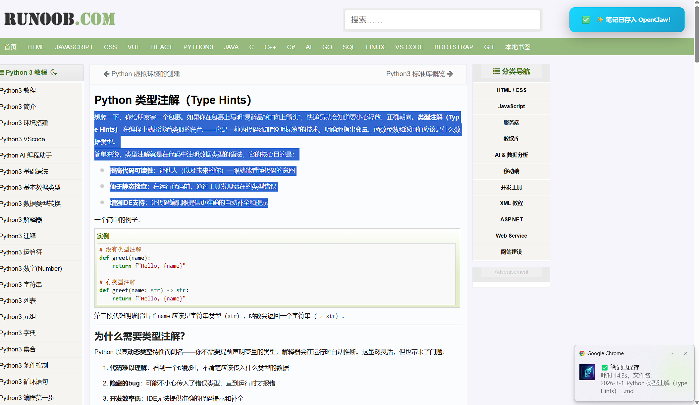

# OpenClaw Notes - 浏览器 AI 笔记助手

OpenClaw Notes 是一款现代化的浏览器扩展，旨在将网页选中的内容（文本或图片）通过 AI 智能总结，并直接保存到您的本地知识库（OpenClaw Agent）。

## 🌟 核心功能

- **🚀 一键总结**：选中网页文本或右键点击图片，通过右键菜单快速发送给 OpenClaw。
- **🎭 深度定制**：支持自定义 **系统提示词 (System Prompt)** 和 **总结模板 (User Prompt)**，完美适配康奈尔笔记、Zettelkasten 等各种笔记流。
- **🖼️ 多模态支持**：不仅可以处理文本，还能发送网页图片给 AI 进行分析总结。
- **📂 自动化保存**：AI 自动根据内容生成文件名，并保存到您指定的本地目录（默认 `workspace/web-notes`）。
- **📜 实时追踪**：内置日志系统和文件生成历史记录，随时查看处理进度。
- **💎 经典深蓝 UI**：经过打磨的 Classic Edition 视觉风格，支持自定义圆角和美化滚动条，操作顺滑。

## 🛠️ 安装说明

1. 下载本项目源代码。
2. 打开 Chrome 浏览器，进入 `chrome://extensions/`。
3. 开启右上角的 **“开发者模式”**。
4. 点击 **“加载已解压的扩展程序”**，选择本项目根目录。-已经废弃
4.1 如果是第一次使用，需要先安装依赖：
   ```bash
   npm install
   ```
4.2 编译项目：
   ```bash
   npm run build  
   ```
   编译完成后，根目录会生成一个 **`dist`** 文件夹。
4.3 加载插件：
   - 打开 Chrome 浏览器，进入 `chrome://extensions/`。
   - 开启右上角的 **“开发者模式”**。
   - 点击 **“加载已解压的扩展程序”**，选择本项目根目录。
5. **重要：配置 OpenClaw 网关**
   修改 OpenClaw 的配置文件 `openclaw.json`：
   ```json
   "http": {
     "endpoints": {
       "chatCompletions": {
         "enabled": true
       }
     }
   }
   ```
   确保将 `enabled` 设置为 `true` 以启用 OpenAI 兼容接口，修改后请重启 OpenClaw。

## ⚙️ 配置要求

- 需要运行 [OpenClaw Gateway](https://docs.openclaw.ai/)。
- 默认网关地址：`http://127.0.0.1:18789`。

## 📸 界面展示

### 1. 极简配置
支持自定义 Gateway URL、Token 及 AI 模型，一键测试连接状态。


### 2. 提示词实验室
灵活配置变量（如 `{pageUrl}`, `{saveDir}`, `{filename}`），让 AI 按照您的意图工作。


### 3. 操作流程
选中内容 -> 右键 -> 发送。


### 4. 成功反馈
集成的 Toast 提示与进度追踪，确保每一条笔记都成功送达。


### 5. 最终生成的笔记示例
AI 会自动提取网页核心知识点，并保留原始链接与标题，以标准 Markdown 格式保存。
> [查看生成的笔记示例 (Markdown)](./picture/2026-3-1_Python%20%E7%B1%BB%E5%9E%8B%E6%B3%A8%E8%A7%A3%EF%BC%88Type%20Hints%EF%BC%89.md)


## 功能记录

2026-03-03
1. 添加了directAI模式，可以直接调用OpenAI的API，不需要OpenClaw网关。


## 🚀 路线图 (Roadmap)

我们计划在未来的版本中引入以下功能：

- **🧠 OpenClaw Skills 深度集成**：直接在网关端调用专门的笔记工具 Skills（如格式转化、大纲提取、Anki 制卡等）。
- **🔄 自动更新与内容同步**：支持对已存在的笔记进行增量更新，实现网页内容与本地知识库的动态同步。
- **🔍 智能去重与防冗余**：在生成新笔记前，自动检索并比对本地相似文件。如果已存在相关主题，则在原文件基础上追加或更新，避免重复生成冗余文件。

## 📄 开源协议

MIT License.
